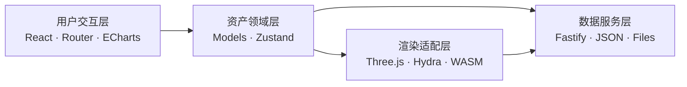

# USD Asset Studio

> 具身智能资产管理与 Web 可视化平台

面向机器人与仿真场景的本地资产工作台，提供 USD/USDZ 资产入库、审核、数据看板、Web 三维预览和多资产场景组合。资产文件、元数据与组合配置由 Fastify 持久化到本地，刷新或重启后仍可使用。

## 预览

| 资产看板 | 资产库 |
| --- | --- |
|  |  |

| 审核中心 | 场景组合 |
| --- | --- |
|  |  |

## 功能

- USD、USDA、USDC、USDZ 上传与本地持久化
- 资产网格/列表、搜索筛选和元数据编辑
- `pending / approved / rejected` 审核流转与审核备注
- ECharts 资产分类、审核状态和实时指标
- OpenUSD WASM + Hydra + Three.js 单资产预览
- 2—3 个已通过资产同场景组合与 Transform 编辑
- 场景组合保存、更新和重新打开

## 技术栈

- React 18、TypeScript、Vite、React Router、Zustand
- Three.js、WebGL、OpenUSD WASM、`@needle-tools/usd`
- Fastify、Multipart、本地 JSON 与文件存储
- ECharts、Node.js test runner

## 快速开始

需要 Node.js `>=22.12 <23`，推荐使用仓库 `.nvmrc` 中的版本。

```bash
nvm install
nvm use
npm ci
npm run dev
```

打开 <http://localhost:5173>。Vite 会将 `/api` 和 `/uploads` 代理到本地 Fastify 服务。

生产模式：

```bash
npm run build
npm start
```

打开 <http://localhost:3001>。

OpenUSD 线程版 WASM 依赖 `SharedArrayBuffer`。开发和生产服务均已配置：

```text
Cross-Origin-Embedder-Policy: require-corp
Cross-Origin-Opener-Policy: same-origin
```

## 常用命令

| 命令 | 说明 |
| --- | --- |
| `npm run dev` | 启动前端和 API 开发服务 |
| `npm run test` | 运行 REST 与持久化集成测试 |
| `npm run typecheck` | TypeScript 类型检查 |
| `npm run build` | 类型检查并生成生产构建 |
| `npm run verify` | 依次运行测试和构建 |

## 架构



- **用户交互层**：看板、资产库、审核中心和场景组合器。
- **资产领域层**：资产、审核、组合模型与业务状态协调。
- **渲染适配层**：OpenUSD 懒加载、Hydra 生命周期、相机和 GPU 资源管理。
- **数据服务层**：REST API、上传校验、本地文件与 JSON 持久化。

## API

| 方法 | 路径 | 说明 |
| --- | --- | --- |
| `GET` | `/api/assets` | 搜索、筛选和分页查询资产 |
| `GET` | `/api/assets/:id` | 获取资产详情 |
| `POST` | `/api/assets` | 上传资产 |
| `PATCH` | `/api/assets/:id` | 更新元数据 |
| `PATCH` | `/api/assets/:id/review` | 更新审核状态与备注 |
| `DELETE` | `/api/assets/:id` | 删除资产 |
| `GET` | `/api/dashboard` | 获取看板聚合数据 |
| `GET` | `/api/compositions` | 获取场景组合 |
| `POST` | `/api/compositions` | 创建场景组合 |
| `PATCH` | `/api/compositions/:id` | 更新场景组合 |

## WebGL 生命周期

- 首次进入三维预览时动态加载 OpenUSD WASM
- 资产列表使用缩略图，不为卡片常驻 Canvas
- 单个视口只维护一个 Canvas 和一个渲染循环
- DPR 限制为 `Math.min(devicePixelRatio, 2)`
- 关闭视口时清理 RAF、事件监听、Hydra Handle 和 Three.js GPU 资源
- 多 Hydra 创建与销毁按批次串行执行，降低共享 WASM VFS 的竞争风险

运行时可通过 `window.__USD_STUDIO_RENDER_STATS__` 查看 Canvas、渲染循环、Hydra Handle 和 WASM 加载次数。

## 数据目录

```text
data/                 # 资产和场景组合元数据
storage/assets/       # 上传的 USD/USDZ 文件
public/thumbnails/    # 演示缩略图
src/rendering/        # Three.js、Hydra 与 WASM 适配
server/               # Fastify 服务和持久化
tests/                # API 集成测试
```

仓库自带轻量 USDA 演示资产和一个场景组合，可直接体验完整流程。

## 项目边界

- 元数据编辑不修改 USD 内部 Prim、材质或几何。
- 场景组合只保存资产 ID 与 Transform JSON，不导出 USD。
- 当前为本地单用户工作流，不包含账号权限、云存储或多人协作。
- 上传流程以自包含资产为主，不处理完整的外部依赖文件集。
- 缩略图使用演示图和占位图，暂未从上传模型自动生成。

## 第三方组件与许可

本项目没有自研 OpenUSD 解析器或底层 Hydra 渲染引擎。USD 解析、OpenUSD WebAssembly 和 Hydra 渲染能力来自 `@needle-tools/usd@1.1.2`；本项目实现 React 产品、资产与审核流程、REST 数据服务，以及 Three.js/Hydra 的渲染生命周期适配。

仓库自主代码、文档和演示资产使用 [MIT License](./LICENSE)。`@needle-tools/usd` 及其相关组件采用独立的非商业许可证，商业使用前请确认上游授权。完整说明见 [THIRD_PARTY_NOTICES.md](./THIRD_PARTY_NOTICES.md)。
