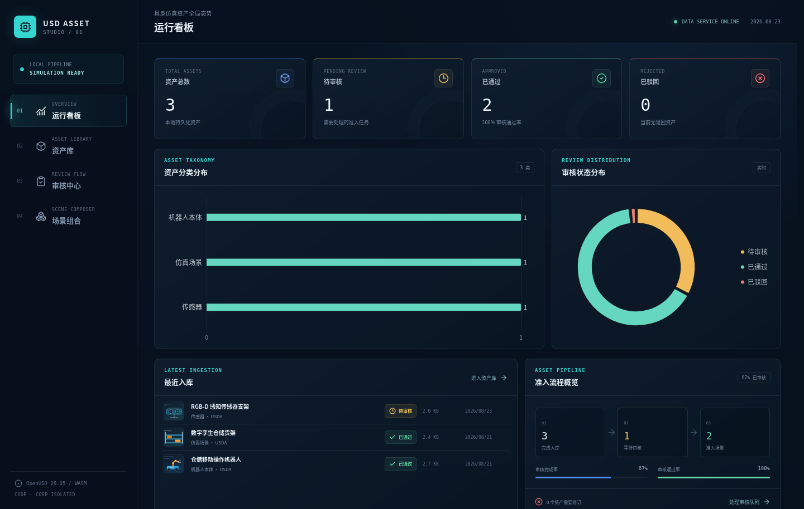
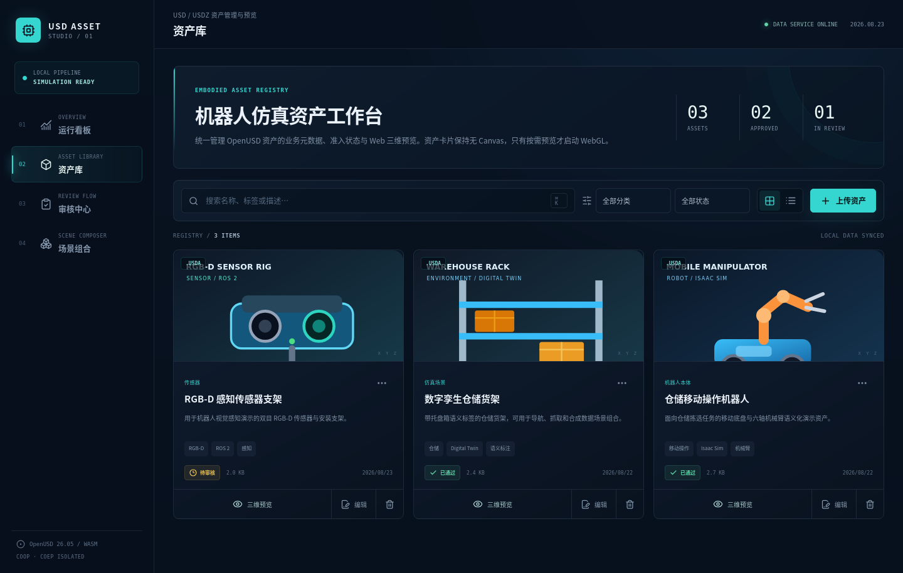
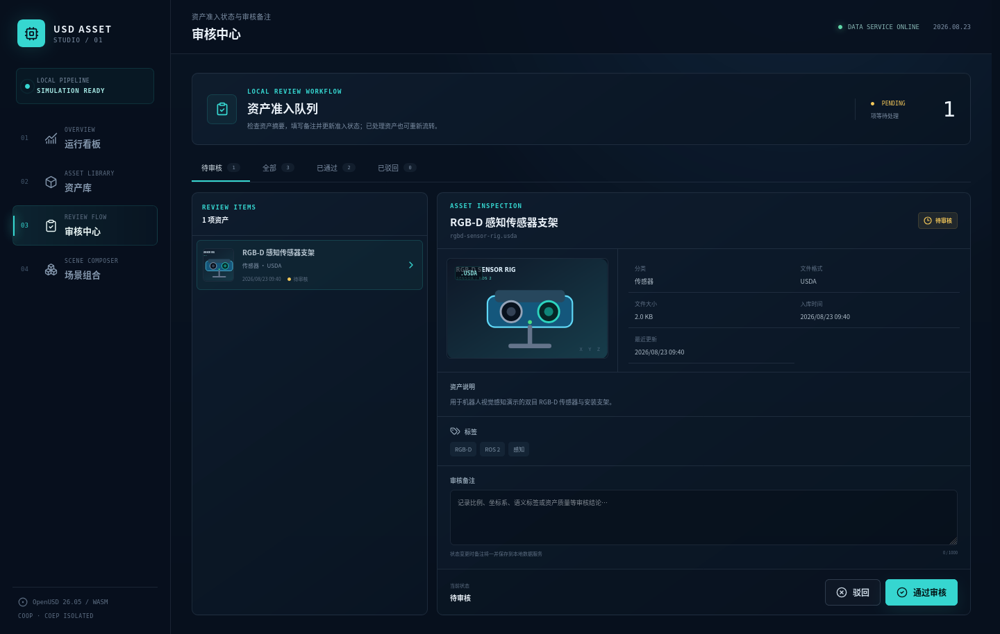
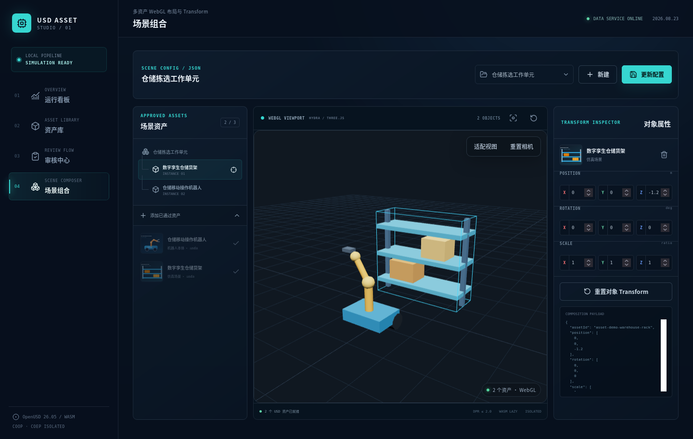
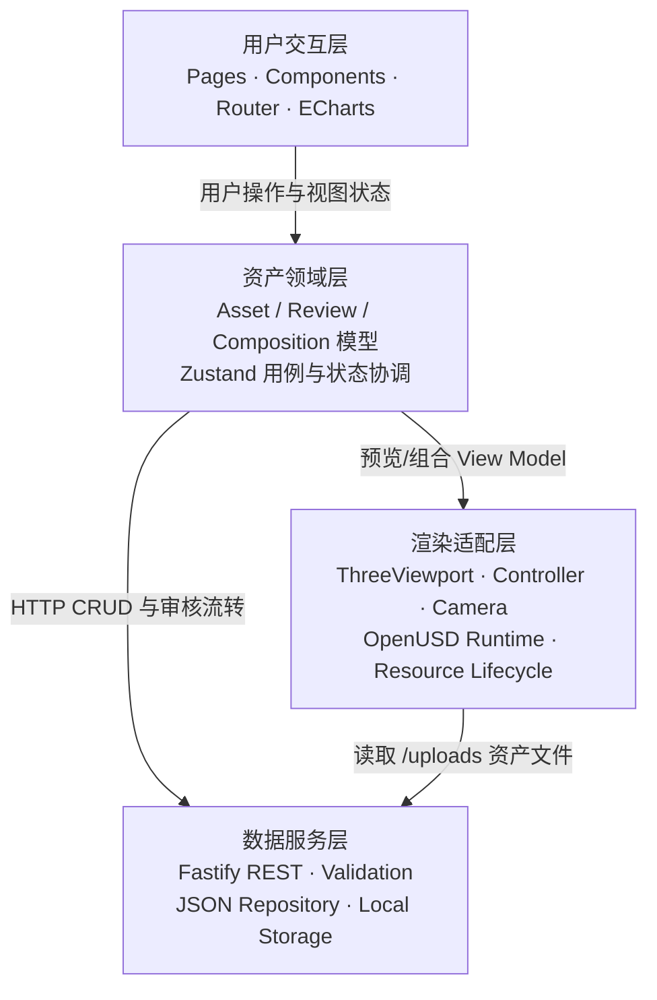

# USD Asset Studio

> 具身智能资产管理与 Web 可视化平台

USD Asset Studio 是一个面向机器人、数字孪生与仿真场景的本地资产工作台。它把真实可操作的资产入库、元数据维护、审核流转、数据看板、OpenUSD Web 三维预览和 2—3 资产场景组合放进一套独立的 React / TypeScript 工程中。

这个项目的重点不是再做一套通用后台模板，而是展示如何把具身仿真的资产语义、OpenUSD/Hydra 渲染约束和前端产品体验组合起来。上传的资产文件、业务元数据、审核状态和场景组合都会由 Fastify 服务持久化到本地；刷新页面后仍然存在。

> [!IMPORTANT]
> 本项目没有自研 OpenUSD 解析器，也没有自研底层 USD/Hydra 渲染引擎。USD 解析、OpenUSD WebAssembly 和 Hydra 渲染能力来自 `@needle-tools/usd@1.1.2`；本项目自主实现的是 React 产品、领域流程、REST 数据服务，以及位于 Three.js、Hydra 与 React 之间的渲染生命周期适配层。该依赖采用非商业许可证，使用前请阅读[许可证说明](#许可证与第三方组件)和 [THIRD_PARTY_NOTICES.md](./THIRD_PARTY_NOTICES.md)。

## 项目截图

| Dashboard | Asset Library |
| --- | --- |
|  |  |

| Review Center | Scene Composer |
| --- | --- |
|  |  |

## 已实现功能

| 模块 | 真实能力 |
| --- | --- |
| Dashboard | 资产总数、待审核、已通过、已驳回 KPI；ECharts 资产分类图和审核状态图；最近入库与流程完成率。数据直接来自 `/api/dashboard`，会随上传和审核结果变化。 |
| Asset Library | 网格/列表切换；250 ms 防抖搜索；分类、审核状态筛选；USD/USDZ 拖放上传；元数据编辑；删除确认；弹窗三维预览。资产卡片只显示 SVG/图片缩略图，不常驻 WebGL Canvas。 |
| Review Center | 按待审核/全部/通过/驳回查看资产；填写审核备注；在 `pending`、`approved`、`rejected` 之间真实流转。已保存组合引用的 approved 资产会被一致性约束保护，需先调整组合才能撤销批准。 |
| Single Asset Preview | 首次打开时按需加载 OpenUSD WASM；Hydra + Three.js 渲染；OrbitControls 环绕、平移和缩放；重置相机、包围盒自适应；加载中、失败和空场景反馈。 |
| Scene Composer | 只能选择 2—3 个已通过资产；同一 Three.js 场景内按批次创建 Hydra 实例；层级/点选选中对象；数值调整 Position、Rotation、Scale；保存、更新并重新打开 JSON 组合。 |
| Local Data Service | Fastify REST API；100 MiB 上传限制；扩展名与文件头基础校验；文件落盘；JSON 原子写入与请求内串行化；结构化错误；生产构建静态托管。 |

仓库自带 3 个轻量 USDA 演示资产和 1 个已保存组合，用于在没有外部模型时直接走通 Dashboard、审核和组合流程。

## 技术栈

- 前端：React 18.3、TypeScript 5.7、Vite 8.2、React Router 7.18、Zustand 4
- 三维：Three.js 0.185、WebGL、OrbitControls、`@needle-tools/usd@1.1.2`、OpenUSD WebAssembly、Hydra Render Delegate
- 可视化：ECharts 6.1
- 服务端：Node.js 22、Fastify 5.12、`@fastify/static` 10、`@fastify/multipart` 10
- 测试：Node.js 内置 test runner + Fastify `inject`
- 数据：本地文件存储 + JSON 元数据仓库

`package.json` 要求 Node.js `>=22.12 <23`，`.nvmrc` 固定为 `22.23.2`。初始 shell 环境是 Node.js `v18.20.8`、npm `10.8.2`；由于 Node 18 已结束维护，且已修复安全公告的 Fastify 5 / React Router 7 要求现代 Node，最终依赖安装和全部验收改用本机已有的 Node.js `v22.23.2`、npm `10.9.8`。

## 快速开始

### 开发模式

```bash
nvm install
nvm use
npm ci
npm run dev
```

没有使用 nvm 时，请先确认 `node --version` 满足 `>=22.12 <23`。

打开 <http://localhost:5173>。该命令同时启动：

- Vite 前端：`127.0.0.1:5173`
- Fastify API：`127.0.0.1:3001`
- `/api` 和 `/uploads` 由 Vite 代理到 Fastify

不要直接双击 `index.html`，也不要用缺少响应头的普通静态服务器打开构建产物。线程版 OpenUSD WASM 使用 `SharedArrayBuffer`，页面必须处于 cross-origin isolated 上下文；项目的 Vite 与 Fastify 配置都已设置：

```text
Cross-Origin-Embedder-Policy: require-corp
Cross-Origin-Opener-Policy: same-origin
```

可在浏览器控制台确认：

```js
window.crossOriginIsolated // true
```

### 生产模式

```bash
npm run build
npm start
```

打开 <http://localhost:3001>。Fastify 会同时提供 `dist/` 单页应用、REST API、缩略图与 `/uploads/` 资产文件，并为所有响应补充 WASM 所需的隔离响应头。服务默认仅监听回环地址，因为本地演示版没有账号与权限系统；可用 `PORT`、`HOST` 环境变量覆盖生产服务监听地址。只有在受信任网络中明确需要其他设备访问时，才应使用 `HOST=0.0.0.0 npm start`。

### 命令

| 命令 | 用途 |
| --- | --- |
| `npm ci` | 严格按 `package-lock.json` 安装依赖 |
| `npm run dev` | 并行启动 Vite 与 Fastify 开发服务 |
| `npm run dev:web` | 只启动 Vite；需要另行提供 API |
| `npm run dev:api` | 只启动带 watch 的 Fastify 服务 |
| `npm run typecheck` | 对前端与 Vite 配置执行 TypeScript `--noEmit` 检查 |
| `npm run test` | 运行本地 REST/持久化集成测试 |
| `npm run build` | TypeScript typecheck + Vite build，生成生产包 |
| `npm start` | 由 Fastify 启动生产构建；应先执行 build |
| `npm run verify` | 顺序执行 test 与 build |

## 四层架构



这四层是职责边界，不表示所有请求都必须串行穿过渲染层：资产 CRUD 走“交互 → 领域 → 数据服务”，三维预览走“交互 → 领域 → 渲染适配”，渲染适配再从数据服务取得 USD 文件。React 不直接持有 Hydra Handle 或 `requestAnimationFrame`；Fastify 也不感知 Three.js 场景对象。

### 各层职责

1. **用户交互层**：四个业务页面、弹窗、表单、Toast、图表和响应式工作台布局。
2. **资产领域层**：`Asset`、审核状态、`SceneComposition`、Transform 规则，以及上传、编辑、审核、组合保存后的数据刷新协调。
3. **渲染适配层**：把可序列化资产/Transform 转换为 Three.js 层级；管理 OpenUSD 懒加载、Hydra 批次、相机、点选、RAF、ResizeObserver 和 GPU 资源。
4. **数据服务层**：上传校验、资产与组合 REST、Dashboard 聚合、本地文件服务、JSON 持久化和 COOP/COEP。

## 目录结构

```text
usd-asset-studio/
├── src/
│   ├── components/
│   │   ├── assets/          # 上传、编辑、卡片与状态组件
│   │   ├── charts/          # ECharts React 边界
│   │   ├── layout/          # 应用框架与导航
│   │   ├── ui/              # Modal、Toast
│   │   └── viewer/          # ThreeViewport React 组件与预览弹窗
│   ├── domain/models.ts     # Asset / Composition 领域类型
│   ├── pages/               # Dashboard / Library / Review / Composer
│   ├── rendering/           # Three.js、Hydra、WASM 与资源生命周期
│   ├── services/api.ts      # HTTP 客户端
│   ├── state/studioStore.ts # Zustand 用例与服务端状态同步
│   └── styles.css
├── server/
│   ├── app.mjs              # Fastify 应用、路由与静态托管
│   ├── index.mjs            # 服务入口和优雅退出
│   └── lib/                 # JSON repository 与输入校验
├── data/
│   ├── assets.json          # 资产业务元数据
│   └── compositions.json    # 场景组合 JSON
├── storage/assets/          # 原始 USD/USDZ 文件
├── public/thumbnails/       # 当前使用的静态/占位缩略图
├── tests/api.test.mjs       # REST、持久化和静态服务集成测试
├── docs/screenshots/
├── vite.config.ts
└── package.json
```

`JsonRepository` 在内存中提供快照读取，用 Promise 队列串行化重叠写请求，并通过“同目录临时文件 + rename”原子替换 JSON，避免简单 `read-modify-write` 丢失更新。它适合单机演示，不等同于数据库事务或多进程并发方案。

## REST API

成功响应统一为 `{ "data": ... }`，列表可带 `{ "meta": { "total", "offset", "limit" } }`；失败响应为 `{ "error": { "code", "message", "details?" } }`。

| 方法 | 路径 | 说明 |
| --- | --- | --- |
| `GET` | `/api/health` | 本地服务健康检查 |
| `GET` | `/api/assets` | 资产列表；支持 `search`、`category`、`status`、`format`、`sort`、`order`、`offset`、`limit` |
| `GET` | `/api/assets/:id` | 单资产详情 |
| `POST` | `/api/assets` | `multipart/form-data` 上传；文件字段名为 `file`，元数据字段为 `name/category/tags/description` |
| `PATCH` | `/api/assets/:id` | 修改名称、分类、标签和描述 |
| `PATCH` | `/api/assets/:id/review` | 修改 `pending/approved/rejected` 与 `reviewComment`；撤销被组合引用资产的 approved 状态时返回 `409 ASSET_IN_USE` |
| `DELETE` | `/api/assets/:id` | 删除元数据和本地文件；同时清理组合引用，少于 2 个资产的组合会被移除 |
| `GET` | `/api/dashboard` | 实时聚合 KPI、分类/状态分布与最近资产 |
| `GET` | `/api/compositions` | 按更新时间获取已保存组合 |
| `POST` | `/api/compositions` | 创建包含 2—3 个已通过资产的组合 |
| `PATCH` | `/api/compositions/:id` | 更新组合名称和资产 Transform |

上传接口接受 `.usd`、`.usda`、`.usdc`、`.usdz`，限制单文件 100 MiB。服务端同时检查扩展名和文件头：USDA 文本头、USDC magic 或 USDZ ZIP magic；这是快速入口校验，不是完整的 USD 内容审计。

## 数据模型

### Asset

```ts
type AssetStatus = 'pending' | 'approved' | 'rejected';

interface Asset {
  id: string;
  name: string;
  originalName: string;
  format: 'usd' | 'usda' | 'usdc' | 'usdz';
  category: string;
  tags: string[];
  description: string;
  status: AssetStatus;
  fileUrl: string;
  thumbnailUrl: string | null;
  size: number;
  createdAt: string;
  updatedAt: string;
  reviewComment: string;
}
```

新上传资产固定以 `pending` 入库。上传文件使用 UUID 文件名落到 `storage/assets/`，业务名称与原始文件名保存在元数据中。

### SceneComposition

```ts
type Vec3 = [number, number, number];

interface SceneComposition {
  id: string;
  name: string;
  assets: Array<{
    assetId: string;
    position: Vec3;
    rotation: Vec3;
    scale: Vec3;
  }>;
  createdAt: string;
  updatedAt: string;
}
```

`rotation` 以便于阅读和编辑的 Euler XYZ **角度值**持久化；渲染适配层应用到 Three.js 前转换成弧度。组合只记录资产 ID 与 Transform，不修改原始 USD，也不导出新的 USD。

## OpenUSD、WASM 与渲染生命周期

### 按需加载和构建产物

`src/rendering/usdRuntime.ts` 只保留 `@needle-tools/usd` 的 type-only 静态引用，首次加载非空预览时才动态 `import('@needle-tools/usd')` 和 `import('@needle-tools/usd/three')`，随后在当前页面会话内 memoize Runtime。Dashboard、资产卡片和审核页不会提前初始化 WASM。

Vite 从依赖的模块/资源引用中自动发现 `.wasm`、`.data` 等文件，并以 hash 文件名发射到 `dist/assets/`；`vite.config.ts` 通过 `assetsInclude` 覆盖对应资源类型。仓库没有把 WASM 从本机绝对路径复制到 `public/` 的脚本，也不依赖原始 `usd-viewer` 目录。因此：

- `npm ci` 后即可构建，不需要手工复制 OpenUSD 文件；
- WASM 仍然只在首次三维预览时由浏览器请求；
- 部署时必须完整保留 Vite 生成的 `dist/assets/`，不能只复制 `index.html`。

### 实际生命周期策略

1. 每个挂载的 `ThreeViewport` 创建且只拥有一个 `ThreeViewportController` 和一个 Canvas；只有 ready 状态运行至多一个连续 RAF，idle、loading、error 仅在状态或交互变化时渲染单帧。
2. 资产身份变化先停止 RAF、发出 abort，再排队销毁旧 Hydra 组；仅 Transform 变化原地更新 Three.js Group，不重载 WASM 或重建 Canvas。
3. 页面隐藏时通过 `visibilitychange` 暂停循环，恢复可见后再启动。
4. 关闭弹窗或离开页面时，同步停止 RAF并移除 resize、pointer、visibility 监听；销毁任一 Handle 前先等待组内所有 `materialsReady()` settled，再按顺序调用 Hydra Handle `dispose()`，避免复杂材质任务与共享 VFS 清理竞争。
5. Hydra 销毁前后分别收集场景资源，再对去重后的 Texture、Material、BufferGeometry 调用 `dispose()`。
6. 最后释放 OrbitControls、render lists 和 renderer，执行 `forceContextLoss()`，移除 Canvas。
7. 构造与 resize 都将 DPR 限制为 `Math.min(window.devicePixelRatio || 1, 2)`。

加载初始化、逐资产进度、失败原因、空场景和 ready 状态均有界面反馈；相机自适应使用对象包围体，不逐顶点扫描。

### 在浏览器中验证资源回收

渲染适配层有意暴露仅供观察的诊断入口（对象本身可被控制台改写，验收时请勿修改）：

```js
({ ...window.__USD_STUDIO_RENDER_STATS__ })
// {
//   activeCanvases: 0,
//   activeLoops: 0,
//   activeHydraHandles: 0,
//   wasmLoads: 0
// }
```

在 `/assets` 页面进行以下检查，并在 ready 或异步销毁稳定后再取样：

| 时点 | `activeCanvases` | `activeLoops` | `activeHydraHandles` | `wasmLoads` |
| --- | ---: | ---: | ---: | ---: |
| 首次打开预览前 | 0 | 0 | 0 | 0 |
| 单资产 ready 后 | 1 | 1 | 1 | 1 |
| 关闭弹窗且销毁完成 | 0 | 0 | 0 | 1 |

还可以核对真实 DOM：

```js
document.querySelectorAll('canvas[data-usd-studio-canvas="true"]').length
```

连续打开/关闭预览时，三个 `active*` 计数和 Canvas 数量都应回到路由基线；`wasmLoads` 在成功初始化后保持 1，因为 Runtime 在页面会话内复用。Scene Composer 本身常驻一个视口，所以在 `/composer` 应与进入页面后的基线比较，而不是期待 Canvas 为 0。开发模式启用了 React StrictMode，挂载阶段可能短暂出现额外创建/清理；以异步生命周期稳定后的计数为准。

### 多 Hydra 共享 VFS 风险

`@needle-tools/usd` 的 Emscripten Runtime 在页面内共享一个虚拟文件系统（VFS）。如果多个 Hydra 实例同时创建或销毁，内部临时路径、同名文件或公共清理目录可能发生竞争；Handle 级 `dispose()` 也不能被当作彼此完全隔离的沙箱。

项目对这个风险做了以下实际处理：

- 上传文件用 UUID 作为服务端文件名，降低不同根资产同名的概率；
- 所有 Hydra create/dispose 都经过一个全局 Promise tail 串行化；
- 一个 2—3 资产组合在同一临界区中逐个创建，整个批次创建完成前不会插入其他批次的销毁；
- 部分创建失败时，在原临界区内按顺序清理已经创建的 Handle；
- 切换组合时先停止渲染并完整批次销毁旧组，等待结束后才创建新组；
- 批次销毁同样逐 Handle 执行，避免同时清理共享 VFS。

这是一种面向本地演示规模的竞态规避策略，不是对任意 USD 依赖图的隔离保证。当前上传接口只接收一个根文件；依赖外部贴图、payload 或 sibling USD 的非打包资产没有多文件解析/上传流程，优先使用自包含 USDZ，或确保资产没有未托管的外部引用。

## 测试与验收清单

`tests/api.test.mjs` 使用临时目录和 Fastify `inject` 覆盖上传、落盘、重启后持久化、搜索、元数据编辑、审核流转、组合引用一致性、Dashboard 聚合、组合创建/更新/重开、严格校验、删除清理、生产静态托管、SPA fallback 与 COOP/COEP。它不伪造浏览器 WebGL 上下文；渲染生命周期目前通过上面的运行时计数进行人工验收。

### 已执行的本地验收（2026-08-23）

- `npm ci`：exit code 0；随后执行的 `npm run verify`（test + build）同为 exit code 0。
- `npm audit`：生产与开发依赖完整扫描为 `found 0 vulnerabilities`。
- `npm run build` 的产物中，WASM 及相关运行时资源已由 Vite 发射到 `dist/assets/`。
- `npm run dev`：已实测 5173 端口的 COOP/COEP 响应头与 `/api` 代理。
- `npm start`：已实测 `/api/health`、SPA 路由刷新回退与 COOP/COEP。
- Firefox 151 + WebDriver：`window.crossOriginIsolated === true`。
- 新会话进入资产库时 3 张卡片、0 Canvas、`wasmLoads=0`，Performance Resource 中没有 `.wasm` 请求；首次打开预览后才变为 1。
- 空 Composer 保留一个可交互视口 Canvas，但 `activeLoops=0`、`activeHydraHandles=0`、`wasmLoads=0`，不会为空场景持续刷新。
- 单资产 ready 后，以真实 WebDriver 鼠标拖拽、滚轮操作验证环绕与缩放，并依次执行重置相机、适配资产；渲染保持 ready。
- 临时上传语法错误的 USDA 后，预览明确显示 `三维资产加载失败` 和失败的 stage URL，错误态 `activeLoops=0`；关闭后 Canvas/RAF/Hydra 均回到 0，随后已删除该探针资产及文件。
- 双资产 Scene Composer ready：`activeCanvases=1`、`activeLoops=1`、`activeHydraHandles=2`、`wasmLoads=1`。
- Scene Composer 将选中资产的 Position X 从 `0` 调整为 `2.5` 后，表单、场景对象与 JSON 配置同步更新；适配视图和重置相机操作后渲染状态仍为 ready。
- 元数据编辑器通过 WebDriver 逐字输入 `ROS 2, Isaac Sim，VLA`，英文/中文逗号与尾随逗号都能保留；该探针未提交，演示元数据未改变。
- 连续 3 次打开/关闭单资产预览：每次 ready 均为 `1/1/1`；关闭且销毁完成后均为 `0/0/0`；`wasmLoads` 始终为 1，DOM 中残留的 USD Studio Canvas 为 0。

上述结果记录的是该日期、该环境下的真实运行结果，不替代其他机器或未来提交上的重新验证。

发布或演示前，应在干净工作区逐项复现：

- [x] `npm ci` 完成，且没有本机绝对路径依赖。
- [x] `npm run test` 完成；确认测试使用临时目录，不污染演示数据。
- [x] `npm run build` 完成；确认 `dist/assets/` 内包含 Vite 发射的 WASM。
- [x] `npm start` 后 `/api/health`、前端路由和刷新回退正常。
- [x] 上传后重启服务仍可读取资产，搜索、分类/状态筛选与元数据编辑有效（API 集成层）。
- [x] `pending → approved/rejected → pending` 流转、审核备注持久化与 Dashboard 聚合正确；组合引用资产的非法撤销会被 409 阻止（API 集成层）。
- [x] 单资产可环绕、缩放、重置和适配视图；加载/失败反馈清晰。
- [x] 同场景加载 2—3 个已通过资产，Position/Rotation/Scale 可调整。
- [x] 组合保存、更新后可在服务重启后重新读取，Transform 与名称一致（API 集成层）。
- [x] 在 `/assets` 连续打开/关闭预览，Canvas、RAF、Hydra Handle 回到基线。
- [x] 在 `/composer` 双资产组合 ready，Hydra Handle 数与资产数一致且只有一个 Canvas/RAF。

## 复用内容与自主实现

| 类型 | 内容 | 边界 |
| --- | --- | --- |
| 第三方复用 | `@needle-tools/usd` 的 `getUsdModule()`、`createThreeHydra()`、Hydra Handle `ready/update/dispose`，以及其分发的 OpenUSD WASM 能力 | USD 解析、stage composition 和底层 Hydra delegate 不属于本项目原创 |
| 第三方复用 | Three.js/WebGL、OrbitControls、React、Fastify、ECharts 等通用库 | 各库保留各自许可证和著作权 |
| 自主实现 | React/TypeScript/Vite 独立产品工程、路由、四个业务页面、交互与视觉体系 | 不依赖原 `usd-viewer` 的 HTML 页面或绝对路径 |
| 自主实现 | Asset/Review/Composition 领域模型、Zustand 用例、Fastify REST、上传校验、本地 JSON 原子持久化 | 审核是可操作的本地状态机，不包装为生产级权限系统 |
| 自主实现 | `ThreeViewport` 组件、命令式 Controller、相机适配/点选、Transform 层级、WASM 懒加载边界、共享 VFS 批次队列、RAF 与 GPU 资源回收、诊断计数 | 这是对底层能力的工程封装，不是新的 USD 渲染引擎 |

本项目开发时参考了 Needle USD Viewer/OpenUSD Web 示例所展示的包使用方式和运行要求，但新项目的业务前端、服务端、数据模型与生命周期封装位于独立仓库。描述项目时应使用“集成/封装 OpenUSD WASM 与 Hydra 渲染能力”，不应使用“自研 OpenUSD 解析器/自研底层 USD 引擎”。

## 当前范围与已知限制

- 资产编辑仅包含名称、分类、标签、描述和审核状态；不修改 USD Prim、几何或材质。
- Scene Composer 只保存资产 ID 与 Transform JSON，不写回或导出 USD。
- 只实现本地单用户审核流；没有登录、RBAC、多人审批、审计日志或实时协作。
- 数据使用单进程 JSON repository；没有 SQLite/外部数据库、对象存储、云部署和生产级检索索引。
- 删除资产会在同一进程队列中依次更新两个 JSON repository 再移除文件，但不是跨文件系统与多仓库的事务；异常断电场景仍需人工核对。
- 当前缩略图是仓库内的演示 SVG/通用占位图，不会从上传模型自动截图。
- 上传接口是单文件流程；未提供外部依赖文件集、断点续传或病毒扫描。
- 应用层没有提供 MaterialX 编辑、Variant 切换、Point Instancing 控件或 USD 导出。底层依赖可能具备的能力不等同于本项目已经提供对应产品功能。
- 组合限制为 2—3 个已通过资产，目标是展示生命周期和 Transform 工作流，不面向大规模场景编辑。
- 自动化测试目前聚焦数据服务；浏览器 WebGL、视觉回归和 GPU 内存需要按验收步骤人工检查。
- OpenUSD 线程版 WASM 依赖现代浏览器、WebGL 和 cross-origin isolation；第三方反向代理或 CDN 也必须保留 COOP/COEP，并让相关资源满足 COEP。

## 许可证与第三方组件

本仓库自主创作的代码、文档与演示资产按 [MIT License](./LICENSE) 提供；该授权**不覆盖**仓库或构建产物中的第三方代码、WASM、字体/图标或其他资产。

尤其需要注意：

- `@needle-tools/usd@1.1.2`：`PolyForm-Noncommercial-1.0.0`
- 间接依赖 `@needle-tools/materialx@1.7.3`：`PolyForm-Noncommercial-1.0.0`
- 商业使用 Needle 组件前，请联系 [Needle](mailto:hi@needle.tools) 获取适用授权

OpenUSD、Three.js、ECharts、Fastify、React 及其他传递依赖继续遵循各自的许可证。不要把上游 OpenUSD 的许可证错误地扩展到整个 Needle Web Runtime，也不要把本项目顶层 MIT 视为对 Needle 组件的再许可。完整说明见 [THIRD_PARTY_NOTICES.md](./THIRD_PARTY_NOTICES.md)。
